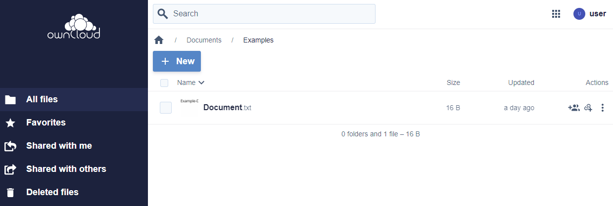

= Navigation

NOTE: You can identify folders by this icon: 

To open a folder, just klick on its name:

Now you can see the content of this folder:

Should you here also find folders, you can open them the same way...:

image::docs_ul_hand.png[open next folder]

...to inspect their content:

Now you want to know where you are?

Above of the listed content you find the path of the folder you actually see:

Let us now have a closer look at the path-indicator:

image::path_indicator.png[path indicator]

